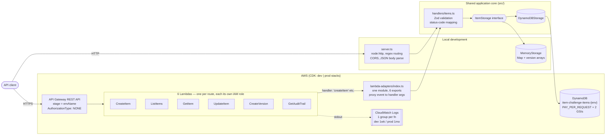
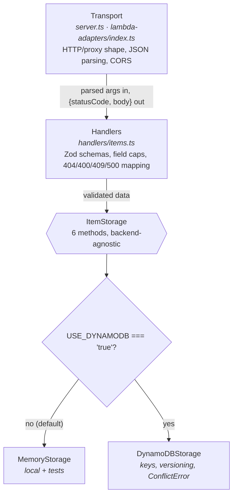
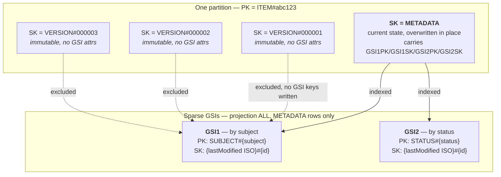
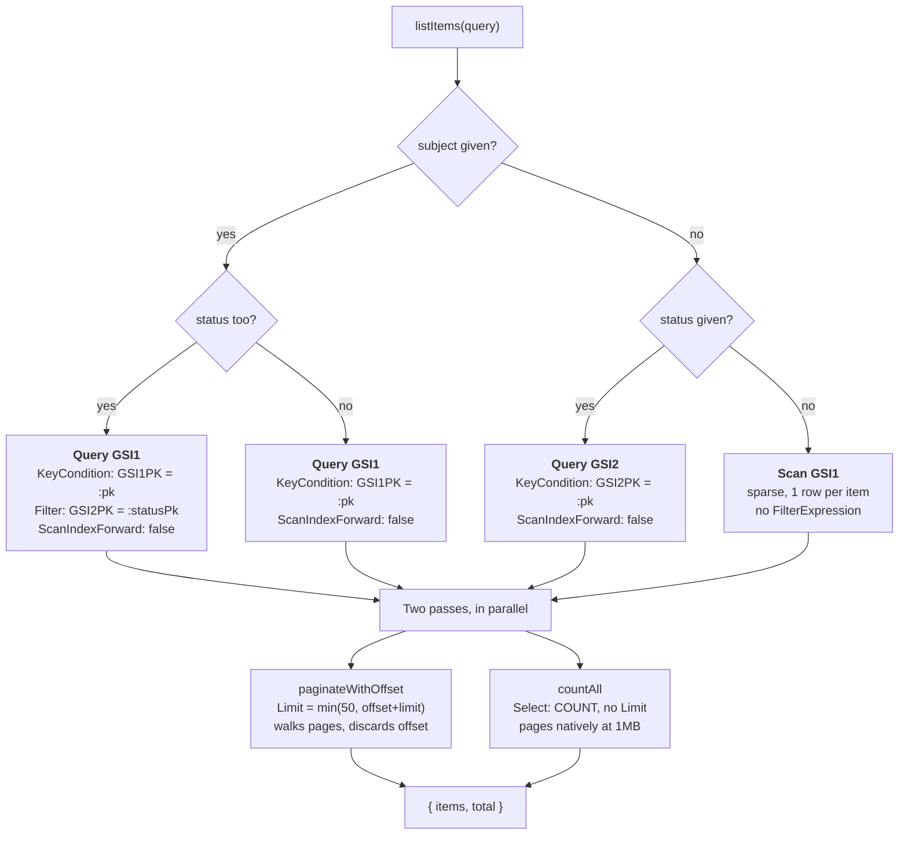
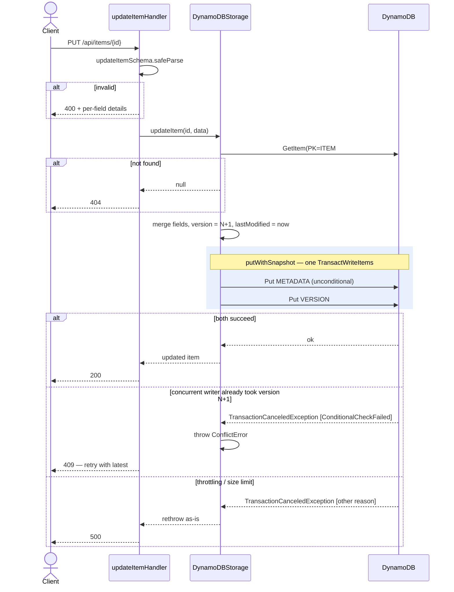

# Architecture Documentation

## Overview

A serverless exam item management API: API Gateway routes requests to one Lambda
per endpoint, each backed by a shared `ItemStorage` interface (`src/storage/interface.ts`)
so the handler layer, storage layer, and infrastructure layer can vary independently.
Locally, `src/server.ts` invokes the same handler functions directly against an
in-memory store; in AWS, a thin adapter module
(`infrastructure/lambda-adapters/index.ts`) invokes the same handler functions
behind API Gateway, backed by DynamoDB.

All 6 endpoints are implemented:

```
POST   /api/items              -> createItemHandler   (201 / 400 / 409)
GET    /api/items              -> listItemsHandler     (200 / 400)
POST   /api/items/:id/versions -> createVersionHandler (201 / 404 / 409)
GET    /api/items/:id/audit    -> getAuditTrailHandler (200 / 404)
GET    /api/items/:id          -> getItemHandler       (200 / 404)
PUT    /api/items/:id          -> updateItemHandler    (200 / 404 / 400 / 409)
```

### System topology



### Layering

Each layer owns one concern, which is what lets the same handler code run behind
both the local server and API Gateway:



## Data Model Design

### DynamoDB schema

Single table (`ExamItems`), storing both an item's current state and its full,
append-only version history as separate rows under one partition:

| | PK | SK | Purpose |
|---|---|---|---|
| Current record | `ITEM#<id>` | `METADATA` | Overwritten in place on every write — fast get/update of "the item as it is now" |
| Version snapshot | `ITEM#<id>` | `VERSION#<version, 0-padded>` | Immutable, written once, never overwritten (`ConditionExpression: attribute_not_exists(PK)`) — the audit trail |

Zero-padding the version number (`VERSION#000001`, `VERSION#000002`, ...) means
ascending `SK` order is chronological order, so the audit trail is a plain
`Query(PK = ITEM#<id>, SK begins_with "VERSION#")` with `ScanIndexForward: true` —
no application-side sorting needed.



Every write that changes item data (`createItem`, `updateItem`, `createVersion`)
uses a `TransactWriteCommand` to write the `METADATA` row and the new `VERSION#`
row atomically, so the current record and its corresponding history entry can
never diverge (e.g. a crash between two separate Puts leaving an orphaned
version or a current record with no matching snapshot).

**GSI1 — "by subject"** (populated only on `METADATA` rows):
- `GSI1PK = SUBJECT#<subject>`
- `GSI1SK = <lastModified ISO>#<id>`
- Serves `GET /api/items?subject=X` newest-first (`ScanIndexForward: false`). A
  status filter is applied as a `FilterExpression` on `GSI2PK` rather than being
  folded into the sort key.

**GSI2 — "by status"** (populated only on `METADATA` rows):
- `GSI2PK = STATUS#<status>`
- `GSI2SK = <lastModified ISO>#<id>`
- Serves `GET /api/items?status=X` newest-first when no subject filter is given.

Both sort keys deliberately carry *only* `lastModified`. An earlier revision put
status first in `GSI1SK` so that subject+status could be served by a
`begins_with` with no filter — but that made status the primary sort for
subject-only queries too, returning a subject's items grouped alphabetically by
status (`approved`, `archived`, `draft`, `review`). With the default page size
that hid a user's own drafts behind a full page of approved items.

Sorting on recency alone fixes the common case, at a real cost on the narrower
one: subject+status now reads the whole subject partition and filters, since
DynamoDB applies `FilterExpression` after reading and bills for what it read.
For a subject with thousands of items and few drafts, that's a lot of read
capacity to return a short page. The right fix at scale is a third GSI keyed
`SUBJECT#<subject>#STATUS#<status>` — exact and ordered, paid for with another
full copy of the data. Two indexes and a filter is the better trade here;
a third index is the move once subject+status becomes a hot path.

Ordering is only as precise as `lastModified`, which is a millisecond
timestamp. Items written in the same millisecond — likely under bulk import —
tie and fall through to the `#<id>` tie-break, which is a random UUID and
therefore arbitrary but stable. A sequence number or a ULID would make the
ordering total rather than best-effort.

Both GSIs use `ProjectionType.ALL` so a list query returns full items with no
follow-up `GetItem`. Version snapshots deliberately carry no GSI attributes, so
history never leaks into list results — only current items are listed, mirroring
the in-memory reference implementation.

**Unfiltered listing** (`GET /api/items` with no subject/status) has no single
partition to query, so it Scans — but it scans **GSI1, not the base table**.
Because GSI1 is sparse and projects everything, it contains exactly one row per
current item, so the scan never reads version rows. A base-table scan would read
every version row and discard it after the fact (DynamoDB filters after reading
and bills for what it read), making the cost scale with total *edits* rather
than total *items*. Scan order is unspecified, so the newest-first guarantee
applies only to the filtered paths. A production system with heavy
unfiltered-list traffic would add a sharded "list all" GSI (e.g. `ALL#<0..N>`,
queried with fan-out) to get ordering and avoid a hot partition.

Putting those paths together, a list request routes like this:



**Concurrency**: version snapshots are written with
`attribute_not_exists(PK)`, which yields optimistic concurrency control for
free. Two updates that both read version N both try to write `VERSION#<N+1>`;
the loser's condition fails, cancelling its transaction, so a lost update is
impossible. The storage layer translates that specific cancellation into a
`ConflictError` and the handlers return **409**, distinguishing it from the
generic 500 that any other transaction failure produces. Non-conflict
cancellation reasons (throttling, item-size limits) deliberately propagate as
500s rather than being mislabelled as conflicts.



**Field size caps**: free-text fields are bounded in the Zod schemas (subject
200, question/explanation 10k, answers 5k, ≤26 options, ≤25 tags). DynamoDB caps
an item at 400KB, and because every edit copies the entire item into a new
version row, an unbounded field is a compounding storage cost rather than just
an oversized request. The caps put a worst-case item near 55KB.

**Pagination**: `ListItemsQuery` is offset/limit (random access), but DynamoDB
only offers forward-cursor pagination (`ExclusiveStartKey`). This is emulated by
walking result pages from the start, discarding the first `offset` matches, and
collecting the next `limit` — correct, but O(offset) per call. `total` is
computed with a separate `Select: COUNT` pass over the same key condition. Both
are documented gaps: a production system would expose an opaque cursor instead
of a numeric offset, and return `hasMore` instead of an exact count (or maintain
a count via DynamoDB Streams) rather than pay for a full pass on every list call.

Full schema rationale and implementation live in `src/storage/dynamodb.ts`
(header comment + inline).

### Application types

`src/types/item.ts` defines `ExamItem` plus narrower request types
(`CreateItemRequest`, `UpdateItemRequest`, `ListItemsQuery`) so client-supplied
input can never set server-managed fields (`id`, `metadata.created`,
`metadata.lastModified`, `metadata.version`) directly — those are always
computed by the storage layer.

## Infrastructure Choices

**AWS CDK, TypeScript** (`infrastructure/`), chosen over Terraform to keep the
whole stack — app and infra — in one language and type system, and to let
infra directly import/reference application code where useful (e.g. bundling
handler entry points via `NodejsFunction`, which uses esbuild to bundle+minify
TS Lambda code with no manual build step).

- **DynamoDB billing**: `PAY_PER_REQUEST` — exam-item authoring is a bursty,
  unpredictable-traffic workload (spiky around content deadlines, near-idle
  otherwise); on-demand avoids capacity planning and paying for idle throughput.
- **Lambda**: one function per endpoint (6 total), each with its own IAM
  execution role, rather than a single monolithic handler — smaller blast
  radius per function, and IAM permissions can be scoped tightly per operation
  (see Security below). Runtime: `NODEJS_24_X`.
- **API Gateway**: REST API (not HTTP API) — chosen for request validators,
  usage plans, and native WAF association, which matter given the
  `securityLevel` field ("secure"/"highly-secure" content implies these will
  eventually need real access controls, even though none are wired up yet —
  see Trade-offs).
- **Lambda adapters** (`infrastructure/lambda-adapters/index.ts`): the handler
  functions in `src/handlers/items.ts` are plain `(id, data) => {statusCode,
  body: object}` functions — Lambda-shaped, but not literally
  `APIGatewayProxyHandler`-shaped, since `body` isn't JSON-stringified and
  there's no `event`/`context` parameter. One adapter module translates between
  the two, exporting one function per route; each Lambda selects its export via
  `NodejsFunction`'s `handler` prop. This keeps the handler layer
  framework-agnostic (it imports no `aws-lambda` types) and keeps the same code
  running locally and on AWS.
- **Environment configuration**: a single stack class
  (`ItemChallengeStack`) parameterized by an `EnvConfig` selected via CDK
  context (`--context env=dev|prod`, defaults to `dev`) rather than duplicate
  stack classes or CloudFormation Mappings — one reviewable, type-checked
  source of truth for how dev and prod differ (removal policy: `DESTROY` vs
  `RETAIN`; log retention: 1 week vs 1 month; point-in-time recovery off vs on).
  Each environment synthesizes its own stack, so both can coexist in one account.
- **CloudWatch Logs**: explicit `LogGroup` per Lambda with environment-specific
  retention, rather than the default (indefinite) retention Lambda would
  otherwise create implicitly.
- **Validation**: `cdk synth --context env=dev` and `--context env=prod` both
  succeed, producing full CloudFormation templates (6 Lambdas, table + 2 GSIs,
  per-function IAM policies, log groups, and all 6 API Gateway routes/methods).

## Security Approach

- **IAM least privilege**: each Lambda gets its own execution role, granted an
  explicitly enumerated list of DynamoDB actions rather than CDK's coarser
  `grantReadData()`/`grantReadWriteData()` helpers (which would hand every
  function the union of Get/Query/Scan/Put/Update/Delete). The lists are derived
  from what each handler actually calls: writes go through `TransactWriteCommand`
  and so need `TransactWriteItems` alongside `PutItem`; `listItems` needs `Scan`
  as well as `Query` because an unfiltered list has no index to use; `getItem`
  needs only `GetItem`. Grants are scoped to this table and its indexes — no
  wildcard resource ARNs.
- **Data classification**: the `securityLevel` field ("standard" / "secure" /
  "highly-secure") is modeled and stored, but no differential access control
  is enforced on it yet — see Trade-offs.
- **Transport/at-rest**: API Gateway terminates TLS by default; DynamoDB
  encrypts at rest by default (AWS-owned key) — no custom KMS key was
  configured for this exercise, which would be the natural next step for
  "highly-secure" content.
- **Input validation**: every write endpoint validates its body against a Zod
  schema before touching storage (see `src/handlers/items.ts`), returning 400
  with structured field-level errors on invalid input rather than passing
  unvalidated data through to the storage layer.

## Scalability & Performance

- DynamoDB `PAY_PER_REQUEST` and Lambda both scale automatically with traffic;
  no fixed capacity to provision or outgrow.
- The subject/status GSIs mean the two most likely real-world list filters
  (browsing a subject's item bank, reviewing items by workflow status) are
  served by a targeted `Query`, not a full-table `Scan` — the Scan path only
  triggers for the fully-unfiltered case.
- Known bottlenecks, both already documented inline where they occur: the
  unfiltered list Scan, and offset-based pagination's O(offset) page-walking
  cost for deep pages. Neither is a problem at the data volumes this exercise
  implies; both are flagged as the first things to revisit before this schema
  meets real production traffic.
- **Version history grows without bound.** Every edit stores a complete copy of
  the item, and nothing expires, compacts, or archives it. Storage grows
  linearly with edit count, and `GET /api/items/:id/audit` returns the *entire*
  history in one response — the storage method pages internally until exhausted,
  so a heavily-edited item produces a large payload and a large read. The field
  caps bound each row; the row *count* is still unbounded. Fixing it properly
  means paginating the audit endpoint, which requires changing the provided
  `ItemStorage.getAuditTrail` signature — see Trade-offs.
- **`STATUS#draft` is the natural hot partition** in GSI2, since most items in an
  authoring workflow sit in draft. Sharding that key would be the first move if
  status-filtered listing became a heavy path.

## Trade-offs & Future Improvements

Given the scope, the following were consciously deferred:

- **`POST /api/items/:id/versions` is redundant with `PUT`.** The provided
  `ItemStorage` contract defines `createVersion(id)` as taking no data: it bumps
  the version number and writes a snapshot identical to current state. But
  `updateItem` *already* appends a version snapshot on every edit, so this
  endpoint produces a duplicate row carrying no new information. It is
  implemented to match the scaffold's contract and the README's route list
  rather than silently redefined, but a real design would either have it accept
  a body (create a new version *from* this content) or drop it, since updates
  are already versioned. Flagging rather than fixing, since changing it means
  diverging from a provided interface.
- **Audit-endpoint pagination**: `getAuditTrail(id): Promise<ExamItem[]>` is
  part of the provided storage interface and has no room for a limit or cursor.
  Bounding it silently would truncate history without telling the caller, so the
  limitation is documented instead. The fix is to widen the interface to return
  a paginated result, alongside the same change for `listItems`.
- **The audit trail records snapshots, not actions.** There is no actor identity
  beyond a client-supplied `metadata.author`, no action type, and no diff. Once
  an authorizer exists, `author` should be derived from the authenticated
  principal rather than the request body — otherwise attribution is forgeable
  and the trail isn't evidentiary. That change belongs in the same commit as the
  authorizer, not after it.

- **AuthN/AuthZ**: API Gateway methods currently have `AuthorizationType: NONE`
  and CORS is wide open. A real deployment — especially one handling
  `secure`/`highly-secure` exam content — needs a Cognito or Lambda authorizer,
  plus authorization logic that actually consults `securityLevel` (e.g.
  restricting "highly-secure" items to a specific role/group) rather than just
  storing the field.
- **No WAF / usage plan / API key**, though the REST API choice leaves room to
  add them without an API type migration.
- **Custom KMS key** for DynamoDB encryption, for stronger control over
  "highly-secure" content than the AWS-owned default key.
- **Pagination**: swap the emulated offset/limit for a cursor-based
  `ListItemsQuery` (opaque `nextCursor` token instead of a numeric `offset`) to
  match DynamoDB's native pagination instead of working around it.
- **Exact `total` count**: replace the full-pass `Select: COUNT` with either a
  `hasMore` boolean or a maintained counter (e.g. via DynamoDB Streams +
  a separate aggregate item) to avoid paying for a full index/table pass on
  every list call.
- **Compliance-driven log retention**: today's retention (1 week dev / 1 month
  prod) is a flat default; regulated exam content may warrant a longer,
  policy-driven retention window instead.
- **Local DynamoDB integration tests**: current DynamoDB storage tests mock
  the SDK client (`aws-sdk-client-mock`) to verify command shapes; running the
  same test suite against DynamoDB Local would catch schema/behavior gaps the
  mocked tests can't (e.g. actual `ConditionExpression` failures, real
  pagination behavior).
